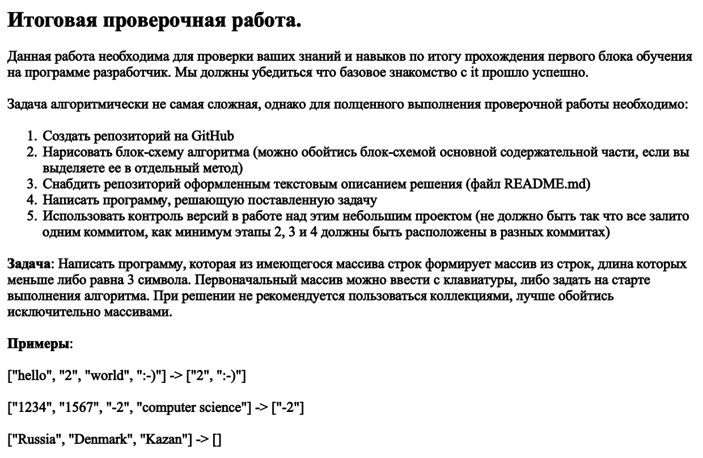
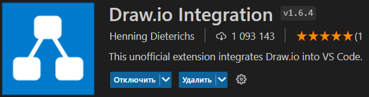
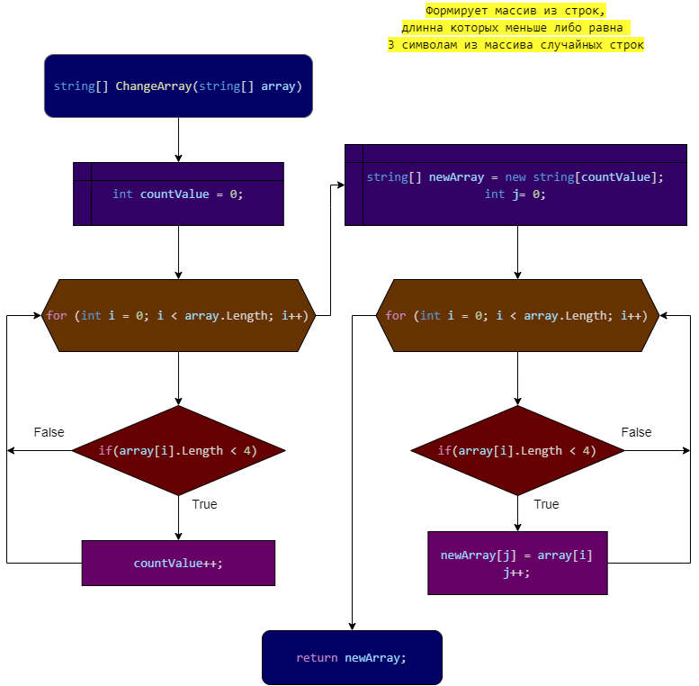
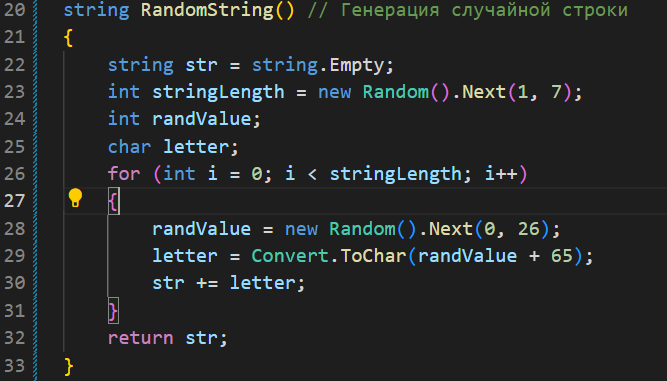
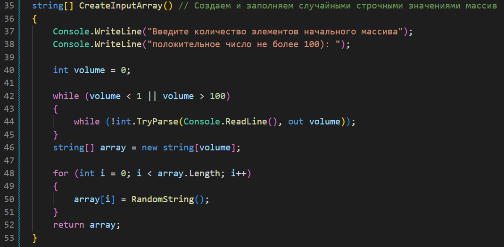
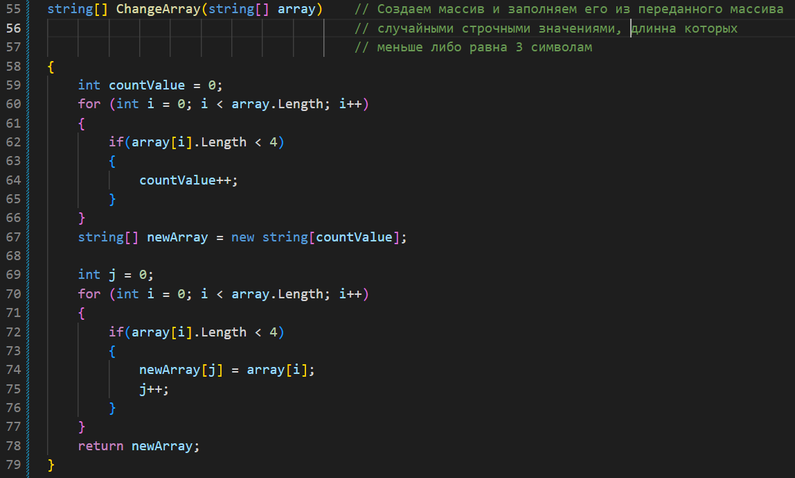
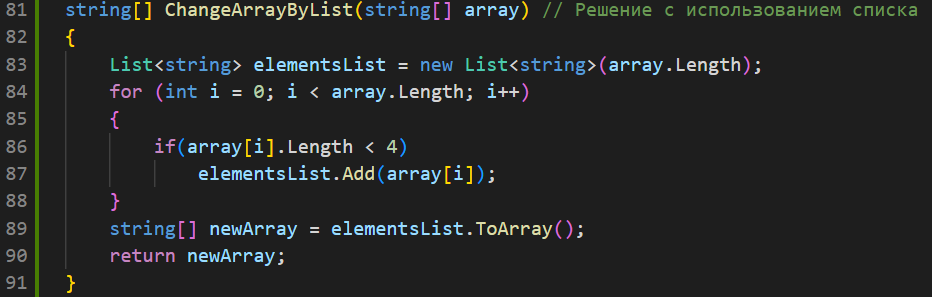
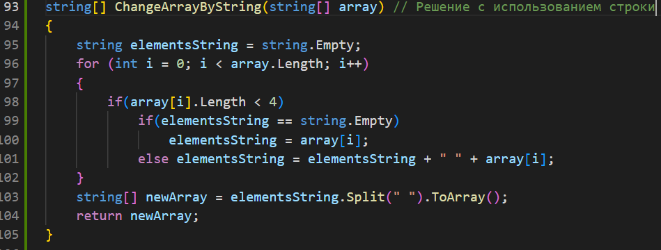
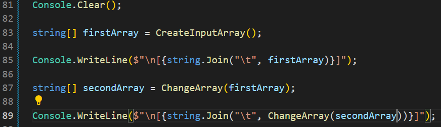
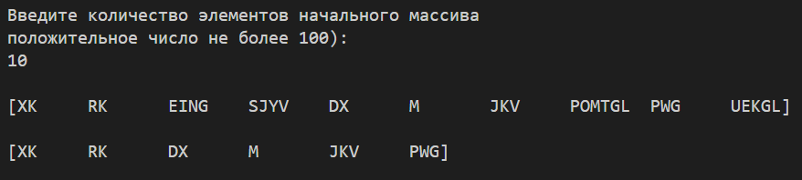

# GBFirstQuarterControlWork

## 1. Создать репозиторий на GitHub

GitHub это удобный удаленный репозиторий, помогающий даже не очень опытным пользователям.

Для того, чтобы наш проект при синхронизации не добавлял системные файлы добавим в корень проекта файл 

    .gitignore

который содержит перечень данных, которые нет необходимости отслеживать в системе контроля версий.

Запустим терминал и выполним команду

    dotnet new console

Так создался Шаблон "Консольное приложение"

Причем, так как в репозитории уже присутствует .gitignore с исключениями, то системные файлы .net не активны и не отслеживаются.

## 2. Нарисовать блок-схему алгоритма

Для выполнения этой части задания я воспользовался расширением  для VSCode

    Draw.io Integration

Это позволяет создать файл с расширением

    .drawio.png

который языком разметки Markdown будет восприниматься как изображение, но появляется возможность вносить в блок-схему изменения.

Блок-схема №1

## 3. Снабдить репозиторий оформленным текстовым описанием решения

Обычно для себя и для читателей моего кода я пишу много комментариев, в теле программы.

Для целей этой части задания комментировать буду здесь.

Объявляем метод RandomString()

В этом методе мы:
+ генерируем случайное число от 0 до 25 и 
+ добавим его к 65, тогда оно станет значением ASCII алфавитов.
+ Значение ASCII преобразуется в символ с помощью метода ToChar().
+ повторяем несколько раз с использованием цикла for, и 
+ формируем строку путем добавления всех случайно сгенерированных символов.
+ Возвращаем случайную строку.

Объявляем метод CreateInputArray()

В этом методе мы:
+ Выводим на экран приглашение для ввода
+ Проверяем введённое значение:
    + Объявляем переменную volume (объем) - размер будущего массива
    + Цикл while проверяет соответствие введённого значения границам
        + Вложенный цикл while проверяет на то, что это число и возвращает его значение
+ Генерируем новый строчный массив
+ Через цикл for назначаем по-порядку каждому элементу массива случайное строчное значение, вызывая метод RandomString()

Объявляем метод ChangeArray()

В этом методе мы:
+ объявляем переменную countValue (счетчик значений)
+ Через цикл for и
    + вложенный цикл if
+ получаем значение переменной countValue равное количеству элементов менее или равное 3 символам
+ создаем новый строчный массив с размером countValue
+ объявляем переменную j - индекс нового массива
+ через цикл for и
    + вложенный цикл if
    + заносим в новый массив, данные из условия
    + увеличиваем индекс.
+ Возвращаем новый массив.

Добавил решение с использованием списка, кода чуть меньше, но задействован другой объект

Добавил решение с использованием строки

Далее в тексте программы:

+ очищаем консоль
+ инициируем новый массив
+ выводим его на экран
+ инициируем новый массив, передав случайным массив методу ChangeArray()
+ выводим на экран искомый массив

Добавление скриншота консоли, с выполненной программой

## 4. Написать программу, решающую поставленную задачу

Составление примерного алгоритма и написание программы вышло у меня довольно быстро, а вот оформление блок-схемы, создание файла README.md, добавление иллюстраций заняло прилично времени.

## 5. Использовать контроль версий в работе над этим проектом

 Git, как система контроля версий и GitHub, как удаленный репозиторий позволяют не только сохранять и контролировать изменения в работе, но и даёт возможность работать одновременно с нескольких устройств, что и было использовано в данной работе.

