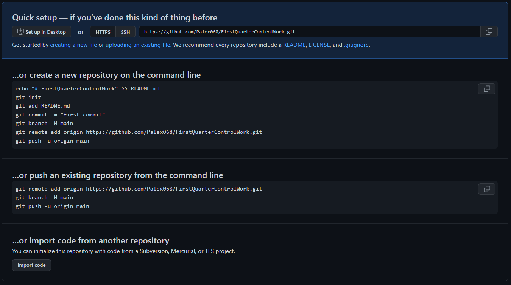

# GBFirstQuarterControlWork

## 1. Создать репозиторий на GitHub

GitHub это удобный удаленный репозиторий, помогающий даже не очень опытным пользователям.

После создания нового репозитория появляется удобное меню быстрой настройки.

Для того, чтобы наш проект при синхронизации не добавлял системные файлы добавим в корень проекта файл 

    .gitignore

который содержит перечень данных, которые нет необходимости отслеживать в системе контроля версий.

Запустим терминал и выполним команду

    dotnet new console

Так создался Шаблон "Консольное приложение"

Причем, так как в репозитории уже присутствует .gitignore с исключениями, то системные файлы .net не активны и не отслеживаются.

## 2. Нарисовать блок-схему алгоритма

Для выполнения этой части задания я воспользовался расширением  для VSCode

    Draw.io Integration

Это позволяет создать файл с расширением

    .drawio.png

который языком разметки Markdown будет восприниматься как изображение, но появляется возможность вносить в блок-схему изменения.

## 3. Снабдить репозиторий оформленным текстовым описанием решения

## 4. Написать программу, решающую поставленную задачу

## 5. Использовать контроль версий в работе над этим проектом

